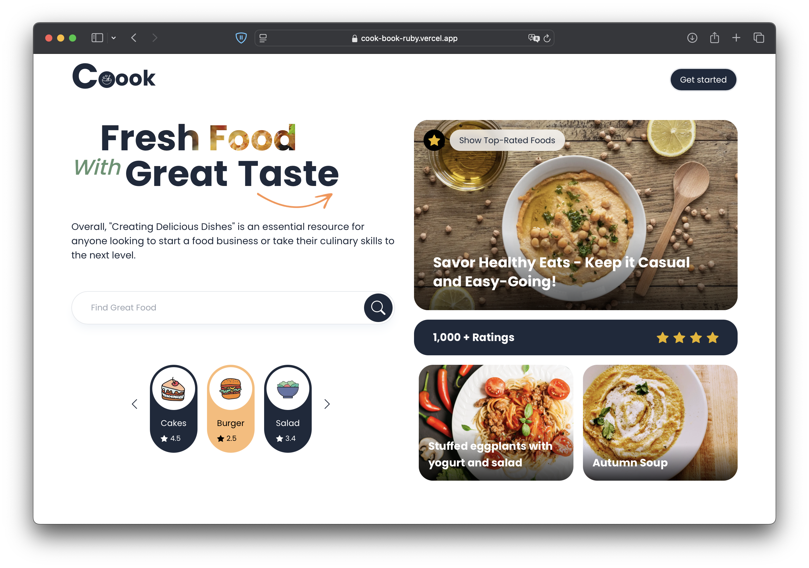

# Recipe Generator Frontend

## Project Description

This is the frontend application for the Recipe Generator project, built using **Next.js**. It interacts with the backend API to fetch AI-generated recipes and images, providing a user-friendly interface. This frontend is part of the [Cook Craft AI](https://github.com/griode/cook-craft-ai.git) project.

## Technologies Used
- **Next.js** – React framework for server-side rendering and static site generation.
- **Tailwind CSS** – For responsive and modern styling.
- **React Query** – For efficient data fetching and caching.

## Environment Variables

Create a `.env` file at the root of the project with the following keys:

```properties
API_KEY=Firebase api key
APP_ID=Firebase app id
AUTH_DOMAIN=Firebase auth domain
MEASUREMENT_ID=Firebase measurement id
MESSAGING_SENDER_ID=Firebase messaging sender id
PROJECT_ID=Firebase project id
```

## How to Run the Project

1. Clone the repository and navigate to the project directory:

```bash
git clone <repository_url>
cd recipe_gen_frontend
```

2. Install dependencies:

```bash
npm install  # or yarn install
```

3. Start the development server:

```bash
npm run dev  # or yarn dev
```

4. Open your browser and go to:

```
http://localhost:3000
```

## Project Structure

```
recipe_gen_frontend/
│── components/       # Reusable UI components
│── pages/            # Next.js pages
│── styles/           # Global styles and Tailwind CSS config
│── utils/            # Helper functions (e.g., API calls)
│── public/           # Static assets
│── .env.local        # Environment variables (not committed to Git)
│── next.config.js    # Next.js configuration
│── package.json      # Project dependencies
```

## Deployment

To deploy the application, you can use **Vercel**:

1. Install the Vercel CLI:

```bash
npm install -g vercel
```

2. Deploy the project:

```bash
vercel
```

Follow the CLI instructions to set up the deployment.

## Screenshots

You can add screenshots of the application in this section to provide a visual overview of the project.


*Presentation of the application*


*App homepage*

## Future Improvements
- Implement authentication for personalized recipe recommendations.
- Add offline support using service workers.
- Improve UI/UX with animations and better error handling.

## Contributors
- @griode

Feel free to contribute and enhance the project! 🚀